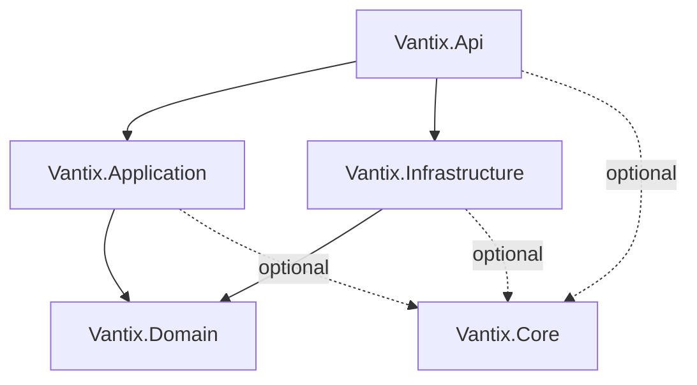

## Solution Overview

The Vantix Sales System consists of **5 projects** organized by architectural layers:

```
Vantix.sln
├── Vantix.Domain/          # Core business entities and rules
├── Vantix.Application/     # Use cases and business logic
├── Vantix.Infrastructure/  # Data access and external services
├── Vantix.Api/            # REST API endpoints
└── Vantix.Core/           # Shared utilities and extensions
```

## Project Dependencies



<Note>
  Dependencies flow **toward** the Domain layer. Domain has zero external dependencies.
</Note>

## Layer-by-Layer Structure

### 1. Vantix.Domain

**Purpose**: Core business entities and domain logic

**Technology**: .NET 10.0 Class Library

**Dependencies**: 
- `Microsoft.EntityFrameworkCore.Design` (for design-time tooling)
- `Microsoft.EntityFrameworkCore.SqlServer` (for entity definitions)

<AccordionGroup>
  <Accordion title="Folder Structure">
    ```
    Vantix.Domain/
    ├── Entities/
    │   └── Models/
    │       └── Clientes.cs      # Customer entity
    ├── ValueObjects/            # Immutable value objects
    ├── Interfaces/              # Repository contracts
    ├── Events/                  # Domain events
    └── Exceptions/              # Domain-specific exceptions
    ```
  </Accordion>
  
  <Accordion title="Key Files">
    **Entities/Models/Clientes.cs**
    
    Located at: `Vantix.Domain/Entities/Models/Clientes.cs`
    
    The core Customer entity:
    
    ```csharp
    namespace Vantix.Domain.Entities.Models;
    
    public partial class Clientes
    {
        public int ClienteId { get; set; }
        public string Nombre { get; set; } = null!;
        public string Apellido { get; set; } = null!;
        public string DocumentoIdentidad { get; set; } = null!;
        public string? Email { get; set; }
        public string? Telefono { get; set; }
        public DateTime? FechaRegistro { get; set; }
        public bool? Activo { get; set; }
    }
    ```
  </Accordion>
  
  <Accordion title="Namespace Convention">
    All types use the namespace pattern:
    
    `Vantix.Domain.{Category}.{Subcategory}`
    
    Examples:
    - `Vantix.Domain.Entities.Models`
    - `Vantix.Domain.ValueObjects`
    - `Vantix.Domain.Interfaces.Repositories`
  </Accordion>
</AccordionGroup>

### 2. Vantix.Application

**Purpose**: Application use cases and business workflows

**Technology**: .NET 10.0 Class Library

**Dependencies**: None (clean project)

<AccordionGroup>
  <Accordion title="Recommended Folder Structure">
    ```
    Vantix.Application/
    ├── Commands/               # Write operations
    │   ├── Clientes/
    │   │   ├── RegistrarCliente/
    │   │   │   ├── RegistrarClienteCommand.cs
    │   │   │   ├── RegistrarClienteHandler.cs
    │   │   │   └── RegistrarClienteValidator.cs
    │   │   └── ActualizarCliente/
    │   └── Ventas/
    ├── Queries/               # Read operations
    │   ├── Clientes/
    │   │   ├── ObtenerCliente/
    │   │   └── ListarClientes/
    │   └── Ventas/
    ├── DTOs/                  # Data Transfer Objects
    │   ├── ClienteDto.cs
    │   └── VentaDto.cs
    ├── Interfaces/            # Application service contracts
    └── Common/               # Shared application logic
    ```
  </Accordion>
  
  <Accordion title="Current Files">
    **Class1.cs**
    
    Located at: `Vantix.Application/Class1.cs`
    
    This is a placeholder file that should be replaced with actual use case implementations.
  </Accordion>
  
  <Accordion title="Use Case Pattern">
    Each use case follows a consistent structure:
    
    1. **Command/Query**: Defines the input
    2. **Handler**: Contains the business logic
    3. **Validator**: Validates the input
    4. **DTO**: Defines the output
    
    Example:
    ```csharp
    // Command
    public record RegistrarClienteCommand(
        string Nombre,
        string Apellido,
        string DocumentoIdentidad);
    
    // Handler
    public class RegistrarClienteHandler
    {
        public async Task<ClienteDto> Handle(
            RegistrarClienteCommand command)
        {
            // Implementation
        }
    }
    ```
  </Accordion>
</AccordionGroup>

### 3. Vantix.Infrastructure

**Purpose**: Data persistence and external integrations

**Technology**: .NET 10.0 Class Library

**Dependencies**:
- `Microsoft.EntityFrameworkCore` (10.0.3)
- `Microsoft.EntityFrameworkCore.SqlServer` (10.0.3)
- `Microsoft.EntityFrameworkCore.Tools` (10.0.3)
- Project Reference: `Vantix.Domain`

<AccordionGroup>
  <Accordion title="Folder Structure">
    ```
    Vantix.Infrastructure/
    ├── Persistence/
    │   ├── VantixDbContext.cs     # EF Core DbContext
    │   ├── Configurations/        # Entity configurations
    │   └── Migrations/            # Database migrations
    ├── Repositories/              # Repository implementations
    │   ├── ClienteRepository.cs
    │   └── VentaRepository.cs
    ├── Services/                  # External service integrations
    │   ├── EmailService.cs
    │   └── PdfService.cs
    └── Entities/                  # Additional infrastructure entities
        └── Models/
```
  </Accordion>
  
  <Accordion title="Key Files">
    **Persistence/VantixDbContext.cs**
    
    Located at: `Vantix.Infrastructure/Persistence/VantixDbContext.cs`
    
    The main database context:
    
    ```csharp
    namespace Vantix.Infrastructure.Persistence;
    
    public partial class VantixDbContext : DbContext
    {
        public VantixDbContext(DbContextOptions<VantixDbContext> options)
            : base(options) { }
        
        public virtual DbSet<Clientes> Clientes { get; set; }
        
        protected override void OnModelCreating(ModelBuilder modelBuilder)
        {
            // Entity configurations
            modelBuilder.Entity<Clientes>(entity =>
            {
                entity.HasKey(e => e.ClienteId);
                entity.HasIndex(e => e.DocumentoIdentidad).IsUnique();
                entity.Property(e => e.Activo).HasDefaultValue(true);
                entity.Property(e => e.FechaRegistro)
                    .HasDefaultValueSql("(getdate())");
            });
        }
    }
    ```
    
    **Entities/Models/Clientes.cs**
    
    Located at: `Vantix.Infrastructure/Entities/Models/Clientes.cs`
    
    <Warning>
      This appears to be a duplicate of the Domain entity. Consider removing this and referencing the Domain entity directly.
    </Warning>
  </Accordion>
  
  <Accordion title="Database Configuration">
    **Connection String** (should be moved to configuration):
    
    ```
    Server=GARIEN-DESKTOP;
    Database=VantixV1;
    Trusted_Connection=True;
    TrustServerCertificate=true;
    ```
    
    <Warning>
      The connection string is hardcoded in `VantixDbContext.OnConfiguring`. This should be moved to `appsettings.json` for security and flexibility.
    </Warning>
  </Accordion>
</AccordionGroup>

### 4. Vantix.Api

**Purpose**: REST API endpoints and HTTP infrastructure

**Technology**: ASP.NET Core 10.0 Web API

**Dependencies**:
- `Microsoft.AspNetCore.OpenApi` (10.0.3)

<AccordionGroup>
  <Accordion title="Folder Structure">
    ```
    Vantix.Api/
    ├── Controllers/              # API endpoints
    │   ├── ClientesController.cs
    │   ├── VentasController.cs
    │   └── WeatherForecastController.cs  # Template example
    ├── Middleware/              # Custom middleware
    ├── Filters/                 # Action filters
    ├── Properties/
    │   └── launchSettings.json  # Development settings
    ├── Program.cs              # Application entry point
    └── appsettings.json        # Configuration
    ```
  </Accordion>
  
  <Accordion title="Key Files">
    **Program.cs**
    
    Located at: `Vantix.Api/Program.cs`
    
    The application entry point and configuration:
    
    ```csharp
    var builder = WebApplication.CreateBuilder(args);
    
    // Add services to the container
    builder.Services.AddControllers();
    builder.Services.AddOpenApi();
    
    var app = builder.Build();
    
    // Configure the HTTP request pipeline
    if (app.Environment.IsDevelopment())
    {
        app.MapOpenApi();
    }
    
    app.UseHttpsRedirection();
    app.UseAuthorization();
    app.MapControllers();
    
    app.Run();
    ```
    
    **Controllers/WeatherForecastController.cs**
    
    Located at: `Vantix.Api/Controllers/WeatherForecastController.cs`
    
    Template controller that should be replaced with actual business controllers.
  </Accordion>
  
  <Accordion title="Dependency Injection Setup">
    Services should be registered in `Program.cs`:
    
    ```csharp
    // Database
    builder.Services.AddDbContext<VantixDbContext>(options =>
        options.UseSqlServer(builder.Configuration.GetConnectionString("DefaultConnection")));
    
    // Repositories
    builder.Services.AddScoped<IClienteRepository, ClienteRepository>();
    
    // Use Case Handlers
    builder.Services.AddScoped<RegistrarClienteHandler>();
    
    // Services
    builder.Services.AddScoped<IEmailService, EmailService>();
    ```
  </Accordion>
</AccordionGroup>

### 5. Vantix.Core

**Purpose**: Shared utilities and cross-cutting concerns

**Technology**: .NET 10.0 Class Library

**Dependencies**: None

<AccordionGroup>
  <Accordion title="Recommended Folder Structure">
    ```
    Vantix.Core/
    ├── Extensions/           # Extension methods
    │   ├── StringExtensions.cs
    │   └── DateTimeExtensions.cs
    ├── Helpers/             # Helper utilities
    ├── Constants/           # Application constants
    └── Attributes/          # Custom attributes
    ```
  </Accordion>
  
  <Accordion title="Usage Guidelines">
    The Core project should contain:
    
    - **Extension Methods**: Utilities for common operations
    - **Helper Classes**: Reusable utility functions
    - **Constants**: Shared constant values
    - **Attributes**: Custom attributes used across projects
    
    <Warning>
      Do NOT put business logic in Core. It should only contain infrastructure-agnostic utilities.
    </Warning>
  </Accordion>
</AccordionGroup>

## File Naming Conventions

<Steps>
  <Step title="Entities">
    Use singular nouns: `Cliente.cs`, `Venta.cs`, `Producto.cs`
  </Step>
  
  <Step title="Interfaces">
    Prefix with 'I': `IClienteRepository.cs`, `IEmailService.cs`
  </Step>
  
  <Step title="Commands/Queries">
    Use verb + noun: `RegistrarClienteCommand.cs`, `ObtenerClienteQuery.cs`
  </Step>
  
  <Step title="Handlers">
    Match command/query name + Handler: `RegistrarClienteHandler.cs`
  </Step>
  
  <Step title="DTOs">
    Use noun + Dto suffix: `ClienteDto.cs`, `VentaDto.cs`
  </Step>
  
  <Step title="Controllers">
    Use plural noun + Controller: `ClientesController.cs`, `VentasController.cs`
  </Step>
</Steps>

## Namespace Conventions

Each project follows consistent namespace patterns:

| Project | Namespace Pattern | Example |
|---------|------------------|----------|
| **Domain** | `Vantix.Domain.{Category}` | `Vantix.Domain.Entities.Models` |
| **Application** | `Vantix.Application.{Feature}` | `Vantix.Application.Commands.Clientes` |
| **Infrastructure** | `Vantix.Infrastructure.{Category}` | `Vantix.Infrastructure.Persistence` |
| **Api** | `Vantix.Api.{Category}` | `Vantix.Api.Controllers` |
| **Core** | `Vantix.Core.{Category}` | `Vantix.Core.Extensions` |

## Configuration Files

<CardGroup cols={2}>
  <Card title="Project Files (.csproj)" icon="file-code">
    - Define target framework (.NET 10.0)
    - Manage NuGet packages
    - Configure project references
    - Enable nullable reference types
  </Card>
  
  <Card title="appsettings.json" icon="gear">
    - Connection strings
    - Logging configuration
    - Application settings
    - Environment-specific overrides
  </Card>
  
  <Card title="launchSettings.json" icon="rocket">
    - Development server URLs
    - Environment variables
    - Launch profiles
  </Card>
  
  <Card title="Migration Files" icon="database">
    - Database schema changes
    - Located in Infrastructure/Persistence/Migrations
    - Generated by EF Core tools
  </Card>
</CardGroup>

## Best Practices

<AccordionGroup>
  <Accordion title="Organize by Feature">
    Within Application layer, group by feature/entity:
    
    ```
    Commands/
      Clientes/
        RegistrarCliente/
        ActualizarCliente/
      Ventas/
        CrearVenta/
        CancelarVenta/
    ```
    
    This makes it easy to find all operations related to a feature.
  </Accordion>
  
  <Accordion title="Keep Controllers Thin">
    Controllers should have minimal logic:
    
    ```csharp
    [HttpPost]
    public async Task<IActionResult> Registrar(
        [FromBody] RegistrarClienteCommand command)
    {
        var result = await _handler.Handle(command);
        return Ok(result);
    }
    ```
  </Accordion>
  
  <Accordion title="Separate Concerns">
    - **Domain**: Pure business entities and rules
    - **Application**: Orchestration and use cases
    - **Infrastructure**: Technical implementation
    - **API**: HTTP concerns only
  </Accordion>
  
  <Accordion title="Use Folders Effectively">
    Create folders to organize code:
    - By feature (Clientes, Ventas)
    - By pattern (Commands, Queries)
    - By type (Entities, DTOs)
  </Accordion>
</AccordionGroup>

## Next Steps

<CardGroup cols={2}>
  <Card title="Architecture Overview" icon="diagram-project" href="/architecture/overview">
    Review the high-level architecture
  </Card>
  
  <Card title="Development Guide" icon="code" href="/development/setup">
    Learn how to add new features
  </Card>
  
  <Card title="API Reference" icon="book" href="/api/overview">
    Explore the API endpoints
  </Card>
  
  <Card title="Quick Start" icon="rocket" href="/quickstart">
    Get started with development
  </Card>
</CardGroup>
